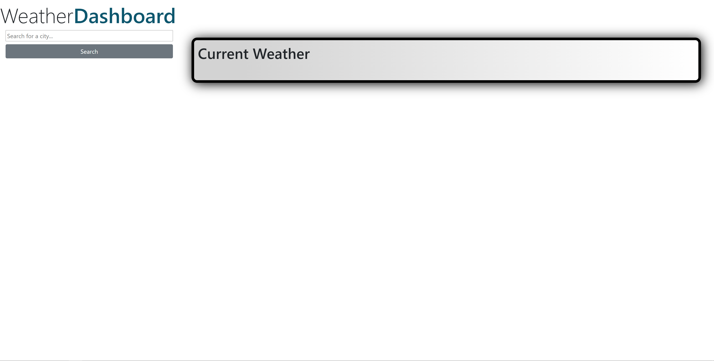
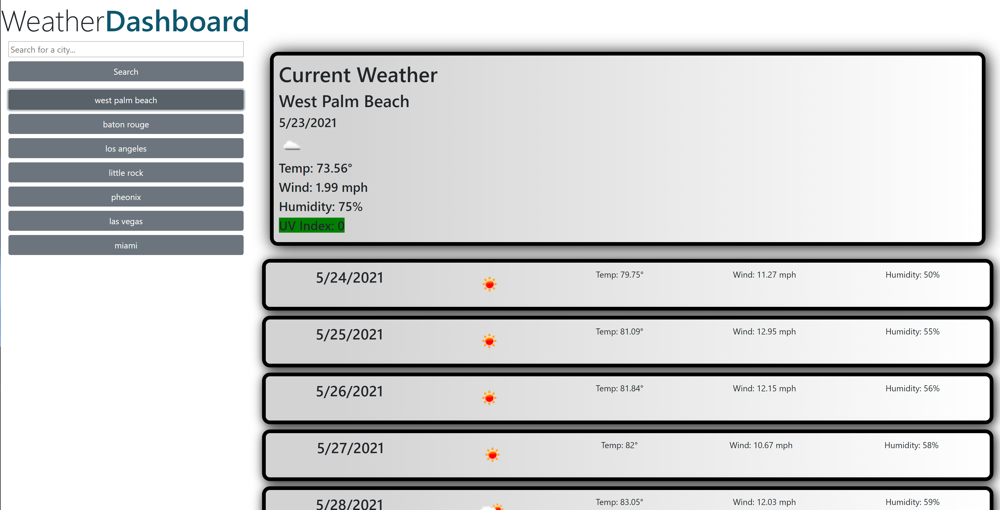
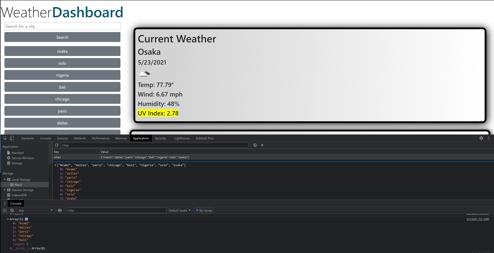

# weather_dashboard

# Weather Dashboard
## Description
Using third-party API, [OpenWeather One Call API](https://openweathermap.org/api/one-call-api), my app retrieves weather data for cities both domestic and international. The Weather Dashboard also stores past searches for easy reference at the click of a button.
The Weather Dashboard is responsive, runs in the browser, and features dynamically updated HTML and CSS.
## Installation
After loading the page, type any city into the search box to return the current weather and a five-day forecast. The most recent five searches will be stored as clickable buttons on the left. To view the weather in a past search, just click on that city's button.

View my project as it is deployed via GitHub: https://malicea0783.github.io/weather_dashboard/

Clone my repo: https://github.com/malicea0783/weather_dashboard.git

